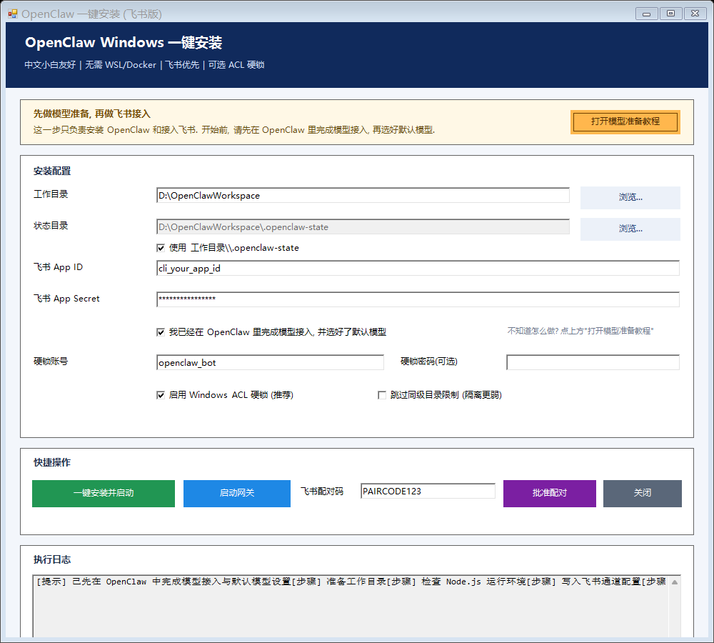

# OpenClaw Windows 一键部署（飞书版）

这是一个面向 Windows 小白用户的 OpenClaw 一键部署项目：

- 默认只启用飞书通道
- 不依赖 WSL
- 不依赖 Docker
- 支持可选 ACL 硬锁边界



上图是当前安装器 GUI 的真实截图。

## 核心优势（可对外宣传）

相对通用托管方案，本项目的 4 个核心优势：

1. Windows 本机可控：不依赖 WSL/Docker，直接在本机文件体系工作。
2. 飞书优先且中文友好：默认飞书通道，界面和流程为中文小白设计。
3. 安全边界可解释：支持低权限账号 + NTFS ACL 的可选硬锁策略。
4. 开源可二开：脚本和流程透明，可私有化、可按团队需求改造。

## 更多可说的特色

除核心优势外，还可以强调：

- 全流程 GUI：安装、启动网关、批准配对都可点按钮完成。
- KISS 部署：默认路径 + 必填最少参数，降低首次上手成本。
- 自动补齐依赖：缺 Node/openclaw 时自动安装。
- 一键体检：`doctor` 脚本可快速判断配置与通道状态。
- 双模式兼容：既可 GUI 给小白用，也可 CLI 给高级用户用。
- 以本地文件为中心：适配 Windows 真实办公文件流，不绕远路。

## 对外文案模板（可直接复用）

短句版：

- 不想折腾 WSL 和 Docker？在 Windows 上一键跑 OpenClaw，飞书开箱即用。
- 给中文小白做的 OpenClaw 安装器：点按钮就能完成安装、启动和配对。
- 主打本机可控 + 可选 ACL 安全边界，兼顾上手速度与可解释安全。

说明版：

本项目是面向 Windows 用户的 OpenClaw 一键部署方案。  
不依赖 WSL/Docker，默认飞书通道，提供中文 GUI 与可选 ACL 硬锁。  
适合不想折腾环境、但希望在本机文件上稳定运行自动化流程的用户。

## 图形界面快速开始

1. 双击 `install.cmd`。
2. 在界面中填写：`工作目录`、`飞书 App ID`、`飞书 App Secret`。
3. 点击 `一键安装并启动`。
4. 如需手动操作，可点击 `启动网关`。
5. 把飞书里的配对码填到 `飞书配对码`，点击 `批准配对`。

默认主流程可全程在 GUI 完成，不需要手打命令。

## 可选命令行模式

```powershell
.\install.cmd cli `
  -FeishuAppId "cli_xxx" `
  -FeishuAppSecret "xxx" `
  -WorkspacePath "D:\OpenClawWorkspace"
```

也可直接运行脚本：

```powershell
powershell -NoProfile -ExecutionPolicy Bypass -File .\scripts\bootstrap-openclaw-feishu.ps1 `
  -FeishuAppId "cli_xxx" `
  -FeishuAppSecret "xxx" `
  -WorkspacePath "D:\OpenClawWorkspace"
```

## 自动完成内容

- 若缺少 Node.js，则自动通过 `winget` 安装 LTS 版本
- 若缺少 `openclaw`，则自动通过 `npm -g` 安装
- 自动写入飞书通道配置到 `~/.openclaw/openclaw.json`
- 默认关闭 Telegram
- 可选应用 `openclaw_bot + ACL` 硬锁策略

## 健康检查

```powershell
powershell -NoProfile -ExecutionPolicy Bypass -File .\scripts\doctor-openclaw-feishu.ps1
```

实时检查（更慢）：

```powershell
powershell -NoProfile -ExecutionPolicy Bypass -File .\scripts\doctor-openclaw-feishu.ps1 -Live
```

## 安全说明

- 这是 Windows 主机侧加固，不是容器/内核级隔离。
- 主要边界来自低权限账号与 NTFS ACL。
- 若使用日常高权限账号运行 OpenClaw，隔离效果会明显变弱。

## 脚本列表

- `install.cmd`：默认 GUI 入口（`install.cmd cli ...` 为命令行模式）
- `scripts/openclaw-easy-gui.ps1`：图形化安装器（含启动网关、批准配对）
- `scripts/bootstrap-openclaw-feishu.ps1`：安装 + 配置 + 可选硬锁
- `scripts/doctor-openclaw-feishu.ps1`：诊断脚本
- `scripts/start-openclaw-gateway.ps1`：后台启动网关
- `scripts/stop-openclaw-gateway.ps1`：停止网关进程
- `scripts/apply-openclaw-hardlock-elevated.ps1`：提权入口
- `scripts/setup-openclaw-hardlock.ps1`：硬锁实现
- `scripts/test-openclaw-hardlock.ps1`：硬锁验证
- `scripts/rollback-openclaw-hardlock.ps1`：回滚硬锁

## 策略文档

- `docs/POSITIONING_AND_STRATEGY.md`：定位与差异化策略
- `docs/LAUNCH_30D.md`：30 天发布执行清单
- `docs/MARKETING_COPY_CN.md`：中文宣传文案模板
- `docs/FEISHU_SECURITY_CHECKLIST.md`：飞书安全检查清单

## GUI 截图命令

```powershell
powershell -NoProfile -ExecutionPolicy Bypass -File .\scripts\openclaw-easy-gui.ps1 -ScreenshotPath .\assets\gui\openclaw-easy-gui.png
```

## 打包命令

```powershell
powershell -NoProfile -ExecutionPolicy Bypass -File .\scripts\make-release-zip.ps1
```

## 许可证

MIT
